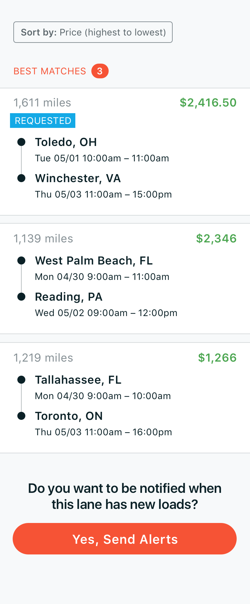

# ConvoyProject

Steps to install:

1)Import this project directly to your local machine.
2)Project the Version control will directly build in Android Studio
3)Choose emulator or phone which is between minSdkVersion 23 and targetSdkVersion 28
4)Build the project
5)Run this app in an emulator or on a phone.

Many truckers prefer Convoy because of the large selection of shipment offers we provide. A shipment offer is an opportunity to move freight between cities at a specified date and price.
We would like you to develop a mobile app that displays these offers to truckers using the provided design. If ambiguities arise, use your best judgment.
Specification

The app should allow the user to paginate through offers and sort them based upon ​pickupDate​(default), ​dropoffDate,​​price​, ​origin​, ​destination,​or ​miles​.
For the Send Alerts area of the app, the button only has to open a dialog box specified in the mock. It should not actually create or send push notification alerts.

● API:​ ​https://convoy-frontend-homework-api.herokuapp.com
● Design:​ ​http://bit.ly/mobile-hw-design

Notes
The API is hosted on a limited Heroku account and may periodically fail or take a while to respond.
Use any mobile app framework, language, or platform of your choosing. We will dedicate some time during your on-site interviews to discuss your implementation choices, so be mindful of tradeoffs and alternatives.
You are encouraged, but not required, to make adjustments to the design, but be prepared to justify your decisions to a designer.
